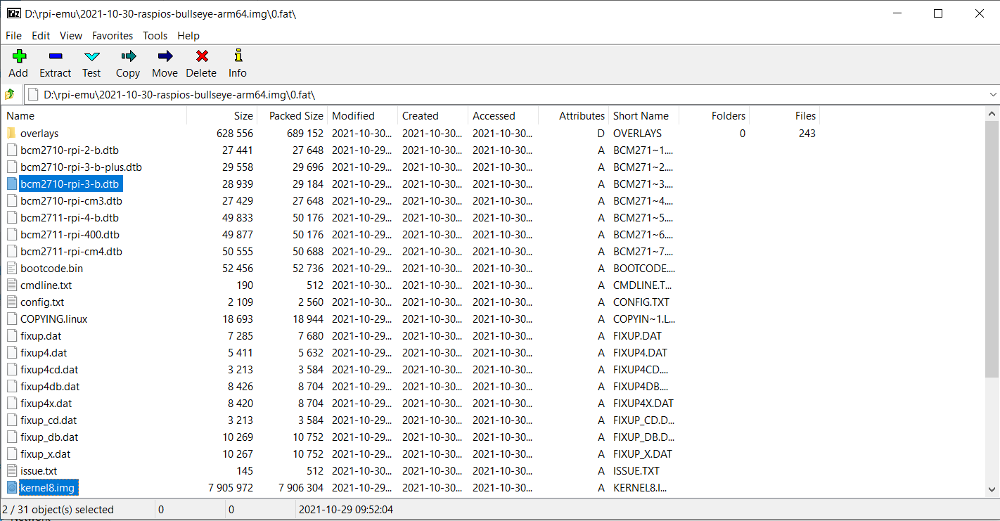
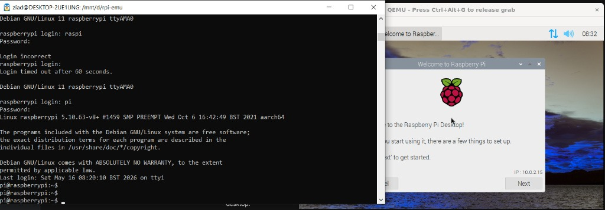

# The Goal
Running full Raspberry Pi ARM64 OS (3B board) on QEMU on WSL on Windows (tested on windows 10). 

Tested Image: `2021-10-30-raspios-bullseye-arm64`. <br>
Board Emulated: `Raspberry Pi 3B`

## Notes
*Note: Tried to emulate the latest rpi os which is* `	2026-04-21-raspios-trixie-arm64`*, but for some reason it kept giving `kernel-panic`, tested with multiple kernel boot flags:*
- `fsck.repair=yes rootwait modprobe.blacklist=brcmfmac sdhci.debug_quirks2=4 dwc_otg.fiq_fsm_enable=0 dwc_otg.fiq_enable=0 systemd.watchdog_device=/dev/watchdog9 systemd.crash_reboot=0 systemd.crash_shell=1`

*Nothing worked.*


## Setup
1. Download tested image **.zip** from <a href="https://downloads.raspberrypi.com/raspios_arm64/images/raspios_arm64-2026-04-21/">here</a>.
2. Extract the image, then Resize it to 8G with script:
```
./resize-8G.sh
``` 
*(eMMC cards sizes should be power of 2 (4G, 8G, 16G), this image size is exactly 3.81, just for emulating purposes resizing the image is necessary inorder to get qemu running, it doesn't take space from your host disk)*

3. After extracting and resizing (make sure of 7zip downloaded): `Right-Click > 7zip > Open Archive`, then open `0.fat`
4. Copy `kernel8.img` and your desired device tree blob (`bcm2710-rpi-3-b.dtb` was tested).



## Running
Run script:
```
./start-rpi-console.sh
```
or
```
./start-rpi-graphical.sh
```
*Notes on running: kernel panic is possible with graphical emulation, removing `-smp` boot flag (Symmetric Multiprocessing) **might** get it working, graphical is so slow and may cause hung ups or freezing, not advised to use/run*

### Default Username and password
- *raspberry login: `pi`*
- *Password: `raspberry`*



## Extras
for some damned reason, resizing the filesystem *(Expand Filesystem)* through `raspi-config` causes hang ups, random freezing on wsl and kernel panics on rebooting.

### Resizing manually is advised:
```
# Expand the virtual sd card container, might skip if ran ./resize-8G.sh script

qemu-img resize -f raw 2021-10-30-raspios-bullseye-arm64.img 8G

# Attach to WSL
sudo losetup -Pf --show 2021-10-30-raspios-bullseye-arm64.img
# (Assuming it mounts to /dev/loop0)

# Grow the partition
sudo growpart /dev/loop0 2

# Check and expand the filesystem
sudo e2fsck -f /dev/loop0p2
sudo resize2fs /dev/loop0p2

# Detach
sudo losetup -D
```
---
### Host forwarding on port 2222
you can ssh into the emulator using:

